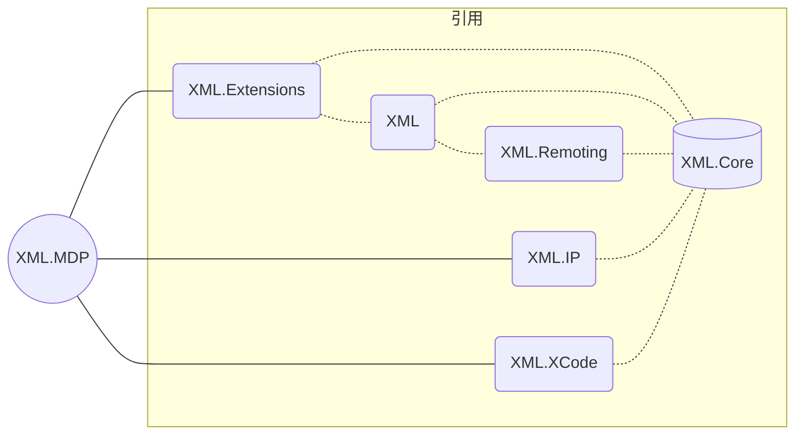

------

== CODE:XML-Veronica ==

# **MDP快速开发平台**


------

[TOC]

## 这是一些图片

没画。。。

## 环境要求

| 项目     | 内容                                                         |
|:-:|---|
|  **.Net版本**  |大版本6.0(如果没有大问题，会按照微软Release进行更新)|
|  **系统要求**  |Windows|
|  **硬件要求**  |最低不知道，反正越高越好~~~~|
|  **软件环境**  |除了DOTNET的要求，WINDOWS可能会要求ADMINISTRATOR权限。WIN -V 1909以上，大版本在这之上应该就是没有啥的问题，至于其他没太注意。  |
|| |
|| |

## 项目说明

### 关于这个项目的一些解释
1. 关于空间命名，有些类是系统SYSTEM的扩展，空间名直接用了SYSTEM，没有用程序空间名，还有一部分Base的直接空间名了，没有带文件夹名，是为了减少一堆USING，位置按空间名进行了划分，可能有些属于计算的却被放到其他地方。部分Data类型（还有其他类型）存放按照使用率就近原则，可能和功能放在一处。存放文件夹名字不一定指的是功能类型，有可能是这个功能的接口。
2. 关于移除UI组件，之前混乱的情况已经有所缓解，移除MVVM和WPF的部分（准确的说是把UI部分都丢了，自己设计UI太麻烦，而且大部分不符合微软的设计文档，主要难看，与系统设计不统一），设计结构改成了前端WinUI/WebUI，后台WinServices（特化型的CS，但是程序是一体的，有点类似X11）。
3. 关于项目结构，这个项目的核心主要是Web，一切基于Web实现，减少了对前端的需求（前端只需要随便设计一下，基于WinUI/WebUI也不是太难，毕竟框架微软都写好了所有都是现成的）。
4. 关于类及接口命名，这一点深思熟虑之后，放弃了，直接翻译吧（后续修改可能进行调整，毕竟写个库还是怎么舒服怎么舒服来）。
5. 关于数据库，由于受CSDN影响，大部分人习惯了一个SQL Helper或者EF裸跑，优点方便，随便搞一下SQL语句即可。然而当项目逐渐扩到，需要的功能支持变多了之后，sql语句会越来越复杂化，业务也会变得极其繁琐。而造成这个的原因便是基础功能过于简陋，只考虑增删改查，只要解决根源上的痛点，数据库的读写操作效率便可以提高一大截。
6. 以后再写。
## 这是一些功能

#### 产品级


- [x] MDP开发平台

- [ ] 分布式缓存

- [ ] 轻量级消息队列

- [ ] 消息队列

- [ ] 物联网

- [x] 服务管理


####  基础扩展

- [x] 类型转换

- [x] 字符串扩展

- [x] 路径扩展

- [x] 数据扩展

- [x] 安全扩展

- [x] 可销毁

- [x] 反射扩展


#### 实用组件

- [x] 日志（文件日志/控制台日志/<u>***窗口日志(未完成)***</u>/网络日志）

- [x] 定时器

- [x] 时间表达式

- [x] 机器信息

- [x] 对象容器

- [x] 轻量级应用主机

- [x] 并行模型

- [x] 脚本引擎（动态编译，<u>***脚本核心(未完成)***</u>）

- [x] 压缩解压缩

- [x] 弱引用委托

- [x] 分布式数字签名令牌

- [x] Web通用令牌

- [ ] 百度地图接口

- [ ] 高德地图接口

- [ ] 阿里云对象存储


#### 序列化与配置

- [x] Json序列化

- [x] Xml序列化

- [x] 二进制序列化

- [x] Csv解析

- [x] Csv数据库

- [x] 轻量级Excel读取器

- [x] 配置系统


#### 数据缓存

- [x] 内存缓存

- [x] 分布式缓存

- [x] 字典缓存

- [x] 对象池

- [x] 数据包

- [x] 分页参数

- [x] 数据集

- [x] 雪花算法

- [x] 经纬度哈希


#### 网络库

- [x] Simple Remote Messaging Protocol

- [x] 网络服务器

- [x] 网络客户端

- [x] 客户端

- [ ] 数据包编码器

- [x] RPC通信服务端

- [x] RPC通信客户端

- [x] 嵌入式设备Web服务器

- [x] 下行通知服务器


## 这是一些结构文档
没写完。。。

##### 关联




##### XML	服务框架

配置中心、集群管理、远程自动发布、服务治理。服务自动注册和发现，故障转移，性能监控。

##### XML.Extensions	服务框架扩展

服务框架功能扩展

##### XML.Agent 	服务主机
 支持多种操作系统的服务监控主机

##### XML.Core	组件核心库
 核心基础组件，日志（文件/网络）、配置（XML/Json/Http）、缓存、网络（Tcp/Udp/Http）、序列化（Binary/XML/Json）、APM性能追踪。

##### XML.Remoting	RPC远程过程调用
 RPC远程过程调用，二进制封装，提供高吞吐低延迟的高性能RPC框架

##### XML.IP	IP地址库
 IP地址解析为物理地址

##### XML.XCode	数据中间件
 数据中间件，支持MySQL、SQLite、SqlServer、Oracle、Postgresql，重点在缓存、性能、分表、自动建表。
--  TDengine、达梦，支持但是巨坑。

##### XML.MDP	快速开发平台 
 WinUI/WebUI平台，带管理后台，可扩展。

 集成了用户权限管理、模板继承、SSO登录、OAuth服务端、数据导出与分享等多个功能模块。

### 2022/11/-已通过1.5GB数据添删改查的测试。
- 测试内容 : 

  多表，存储过程，时序任务综合增删改查。

- 测试环境如下 : 

  测试配置 ：

   ECS.HFG5.2XLARGE(X1)

   CPU : Intel Xeon(Skylake) Gold 6149 处理器，3.1GHz 的主频，8 vCPU。

   内存 : 32 GiB

   内网带宽 : 2 Gbps

   内网收发包 : 100 万 PPS

   硬盘 : SSD云盘 500GB

   系统 : Windows Server 2022 数据中心版 （不含UI）

   副服务器 : G6(X4)(负载均衡失效，BUG在修改)

- 测试结果 : 

   

   


## 规则（重要也不重要）
这个样子写
```C#
    using .....
    namespace NameSpaceName;
    /// <summary> XXXX </summary>
    Class ClassName
    {
    ///
    }
````
不要用默认的样子

## 部分许可

